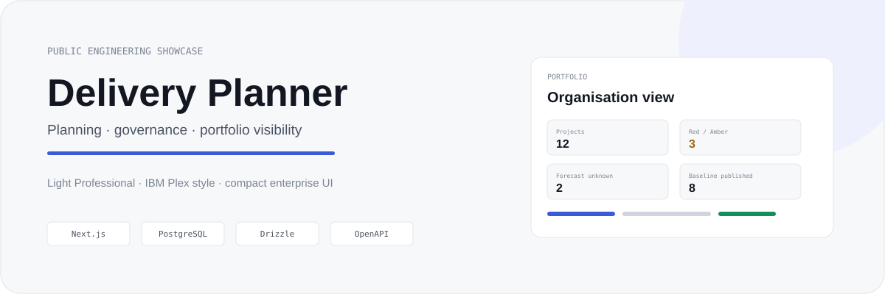
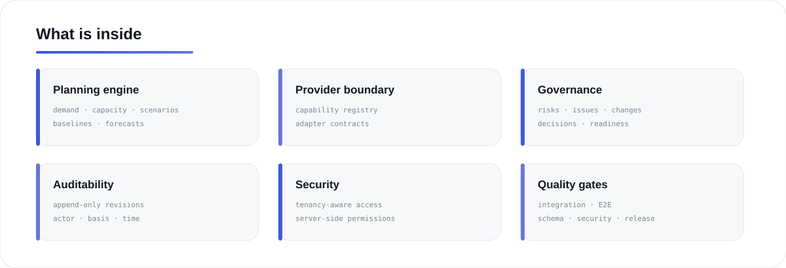
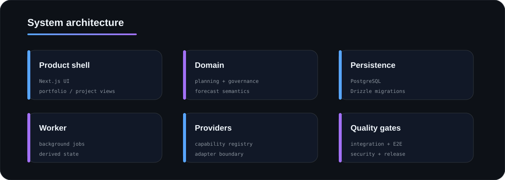
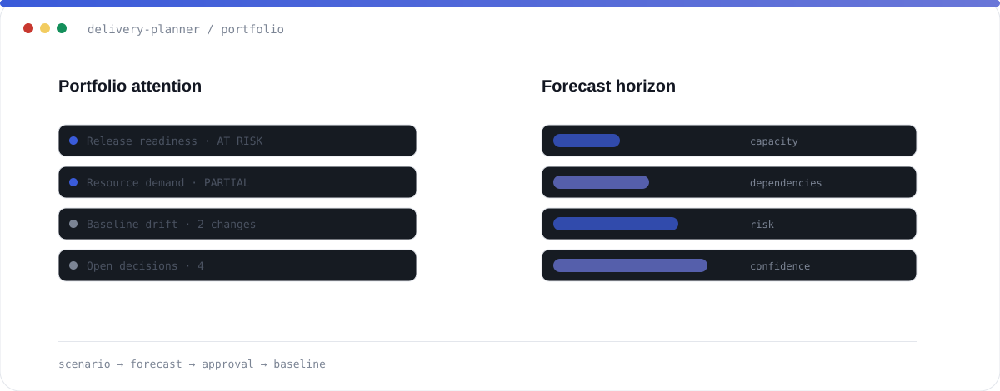
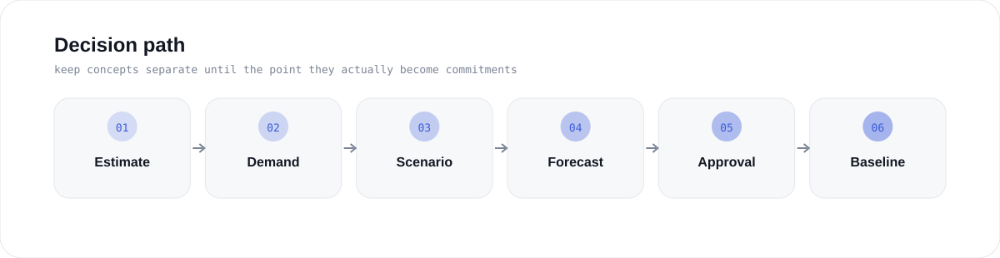

  
  
  
  
  

# Delivery Planner

A planning and governance product I built around one rule: **do not collapse different management facts into one convenient status**.

Estimate is not commitment. Demand is not allocation. Forecast is not baseline.

## <code>01 / product_surface</code>

## <code>02 / system</code>

## <code>03 / decision_path</code>

## <code>04 / hard_parts</code>

| Problem | Design choice |
|---|---|
| forecasts become accidental commitments | forecast and approved baseline are different objects |
| staffing assumptions become facts | demand, allocation and coverage stay separate |
| missing data becomes green | unknown remains a first-class state |
| provider limitations disappear in UI | explicit capability registry |
| dates become impossible to explain | derived results retain inputs and basis |

> **Rule zero:** unknown is not zero.

## <code>05 / inspect</code>

- [Architecture deep dive](docs/ARCHITECTURE.md)
- [Simplified domain model](docs/DOMAIN_MODEL.md)
- [Sanitised provider adapter](examples/provider-adapter.ts)

<b>Why the full source is private</b>

The private repository contains the complete application, migrations, tests, deployment configuration and integration logic. This showcase exposes the engineering without turning the product itself into open source.

