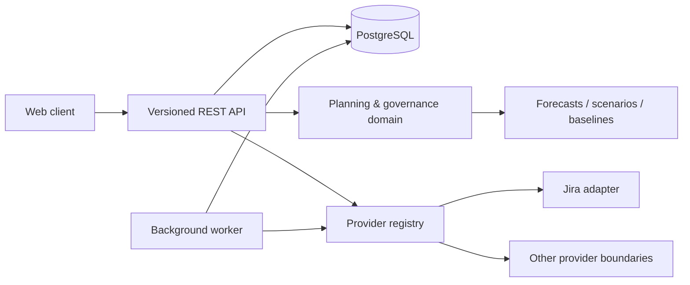

  

  
  
  
  
  

# Delivery Planner — public engineering showcase

A provider-neutral workspace for **planning, delivery governance, resource capacity, forecasting and portfolio visibility**.

The production repository is private. This public repository documents the architecture, engineering decisions and selected sanitised examples without publishing proprietary implementation.

## Why this project exists

Execution systems are good at recording work. They are usually weaker at answering:

- What is actually committed?
- What is only a forecast?
- Which demand is covered by real capacity?
- Which dependencies can move the date?
- What changed since the approved baseline?
- Which decisions can be traced back to their inputs?

Delivery Planner separates those concepts instead of collapsing them into a single "status".

## Architecture

### Core design

- **Modular monolith**: Next.js application + Node background worker.
- **PostgreSQL + Drizzle** for persistent domain state.
- **Versioned REST/OpenAPI** contract.
- **Provider adapter boundary** so execution systems do not own planning semantics.
- Explicit separation of **estimate, demand, allocation, scenario, forecast and baseline**.
- Append-only revisions for decision-relevant facts.
- Tenant-aware permissions, audit events and integration-token handling.
- Integration, E2E, schema, security and release checks in CI.

## Engineering highlights

| Area | Approach |
|---|---|
| Planning | Deterministic resource-constrained scenarios |
| Capacity | Explicit demand, allocation and partial coverage |
| Governance | Risks, issues, changes, decisions, escalations |
| Forecasting | Reproducible inputs + as-of basis + warnings |
| Integrations | Provider capability registry + adapter boundary |
| Security | Server-side permissions, tenancy checks, auditability |
| Delivery | Baselines are approved facts; forecasts remain forecasts |

## A principle I care about

> **Unknown is a state, not zero.**

Missing capacity, missing provider capability or missing forecast evidence should stay visible instead of silently turning into a green dashboard.

## Repository map

- [Architecture](docs/ARCHITECTURE.md)
- [Domain model](docs/DOMAIN_MODEL.md)
- [Sanitised provider adapter example](examples/provider-adapter.ts)

## Source availability

This is a **showcase repository**, not the full product source. The private codebase contains the complete application, migrations, tests, deployment configuration and integration logic.
