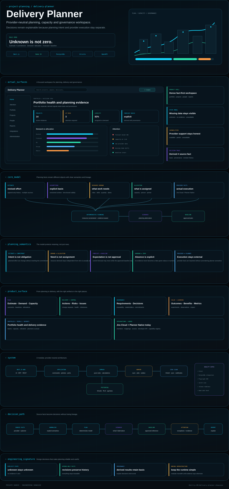

  
  
  
  
  

# Delivery Planner

A provider-neutral planning and governance workspace built around one rule: **different planning facts stay different facts**.

The private implementation models estimates, assumptions, resource demand, allocations, provider execution, scenarios and baselines independently so a convenient dashboard cannot silently rewrite the meaning of the underlying data.

> **Unknown is not zero. Forecast is not baseline. Demand is not allocation. Estimate is not commitment.**

## What this demonstrates

- portfolio, project, people, reporting, integration and administration surfaces;
- append-only planning facts and revision history;
- deterministic resource-constrained planning;
- scenarios and approved baselines as separate concepts;
- provider facts kept separate from planner-owned facts;
- Jira Cloud and Planner Native integration boundaries;
- attention signals that retain evidence and basis;
- a modular Next.js / Node.js / PostgreSQL architecture with workers and explicit quality gates.

## Engineering decisions

| Decision | Why it matters |
|---|---|
| **Explicit state** | missing evidence never becomes a fake zero or green status |
| **Append-only facts** | revisions can be inspected instead of overwritten |
| **Provenance** | derived results retain the inputs and basis that produced them |
| **Provider-neutral boundaries** | external execution systems do not own planner semantics |
| **Modular monolith** | operational simplicity until evidence justifies another boundary |

## Inspect

- [Architecture deep dive](docs/ARCHITECTURE.md)
- [Simplified domain model](docs/DOMAIN_MODEL.md)

<b>Public / private boundary</b>

The implementation is private. This repository is a sanitised engineering showcase: no production credentials, customer data, private provider configuration or commercial operating data is published.

