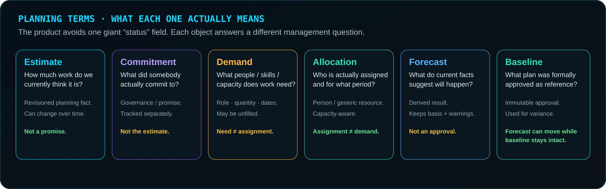
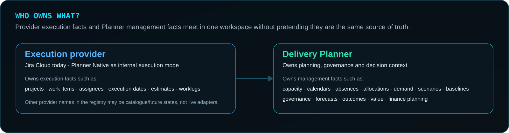

> **A provider-neutral planning and governance workspace for PM / Delivery / PMO decisions.**  
> It combines execution facts with planner-owned capacity, scenarios, baselines, governance and value data without collapsing them into one fake “status”.

<table>
<tr>
<td align="center"><b>Next.js</b> product shell</td>
<td align="center"><b>Node 24</b> runtime</td>
<td align="center"><b>PostgreSQL</b> planning state</td>
<td align="center"><b>Jira Cloud</b> implemented external adapter</td>
<td align="center"><b>Planner Native</b> internal execution mode</td>
<td align="center"><b>Unknown ≠ zero</b> first-class state</td>
</tr>
</table>

## Product workspace

<table>
<tr>
<td width="33%" valign="top"><b>Portfolio / PMO</b> See project health, risks, overdue/unassigned/unestimated work, capacity conflicts and trends across projects.</td>
<td width="33%" valign="top"><b>Project / Delivery</b> Plan work, demand, allocations, milestones, risks, actions, changes, requirements, decisions and release readiness.</td>
<td width="33%" valign="top"><b>People / Resources</b> Model calendars, absences, partial allocation, generic resources, shared-service contention and coverage gaps.</td>
</tr>
</table>

## The planning model

> **The important part is not the dashboard. It is the semantics.**  
> The system preserves the difference between what is estimated, needed, assigned, forecast and formally approved.

## Provider vs Planner

<table>
<tr>
<td width="50%" valign="top"><b>Provider-neutral does not mean every provider is implemented.</b> Jira Cloud is the implemented external adapter. Other names in the provider registry can exist as catalogue/future capabilities and must never appear as fake “Connected”.</td>
<td width="50%" valign="top"><b>Planner Native is not another external connector.</b> It is the internal execution mode for organisations that want Planner-owned projects/work items without Jira or another external provider.</td>
</tr>
</table>

## Decision path

<table>
<tr>
<td width="33%" valign="top"><b>Append-only facts</b> Estimate revisions, approvals and invalidations preserve previous history instead of overwriting it.</td>
<td width="33%" valign="top"><b>Provenance</b> Derived schedules, forecasts and attention signals retain their inputs, policy/algorithm, warnings and as-of basis.</td>
<td width="33%" valign="top"><b>Explicit uncertainty</b> Missing estimate, assignee, capability or evidence remains visible instead of silently becoming 0 / false / green.</td>
</tr>
</table>

## Architecture

<table>
<tr>
<td width="33%" valign="top"><b>Web application</b> Next.js shell and REST/OpenAPI boundary.</td>
<td width="33%" valign="top"><b>Domain / application layer</b> Planning rules, policies, deterministic scheduling and explicit ownership boundaries.</td>
<td width="33%" valign="top"><b>Worker / persistence</b> PostgreSQL/Drizzle persistence plus provider sync and background work.</td>
</tr>
</table>

## Engineering signature

<b>Current maturity / non-goals</b>

- The repository is pre-production; identity, Jira provisioning, secrets, network, monitoring and deployment still need target-environment setup.
- No claim of automatic staffing/matching, employee scoring, attrition prediction, payroll/HR, external notification delivery or Jira write-back.
- Finance and protected stakeholder data remain permission-gated.

