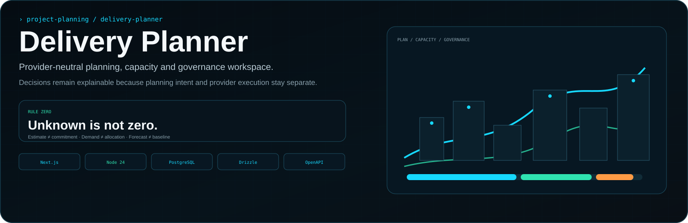
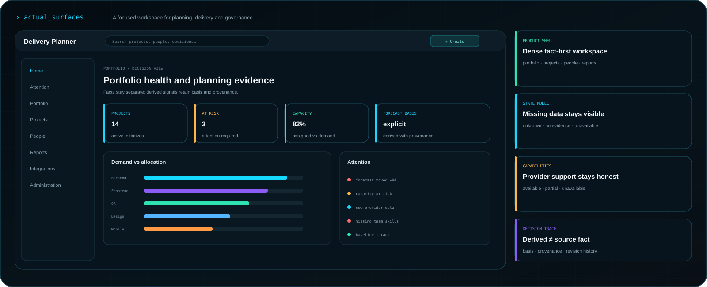
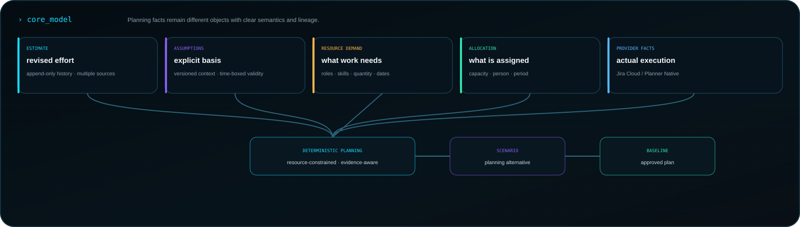
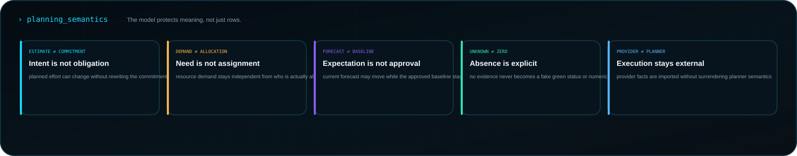
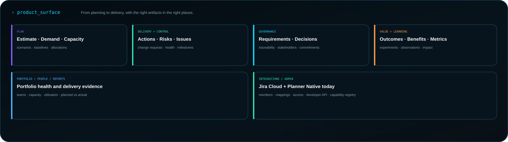
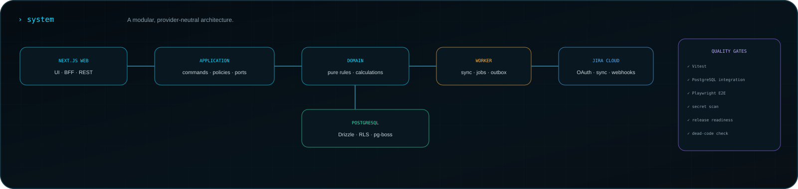
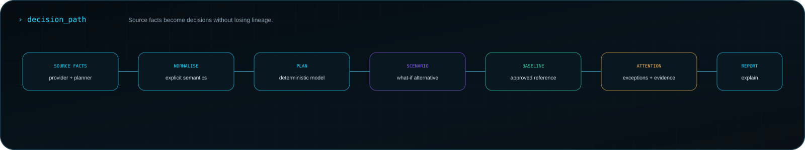
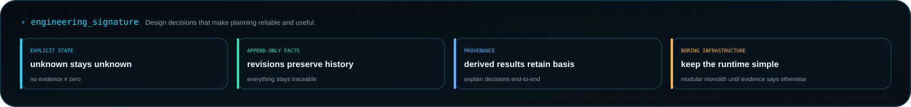

<table>
<tr>
<td width="20%" align="center"><b>Next.js</b> application shell</td>
<td width="20%" align="center"><b>Node 24</b> runtime</td>
<td width="20%" align="center"><b>PostgreSQL</b> planning state</td>
<td width="20%" align="center"><b>Jira Cloud</b> provider boundary</td>
<td width="20%" align="center"><b>Explicit state</b> unknown ≠ zero</td>
</tr>
</table>

<table>
<tr>
<td width="52%" valign="top"></td>
<td width="48%" valign="top"></td>
</tr>
</table>

<table>
<tr>
<td width="50%" valign="top"></td>
<td width="50%" valign="top"></td>
</tr>
</table>

<b>Engineering notes</b>

- Estimate ≠ commitment
- Demand ≠ allocation
- Forecast ≠ baseline
- Provider facts remain separate from planner-owned facts
- Revision history is preserved instead of overwritten
- Derived signals retain basis and provenance
- Architecture and domain examples are sanitised because the implementation is private

