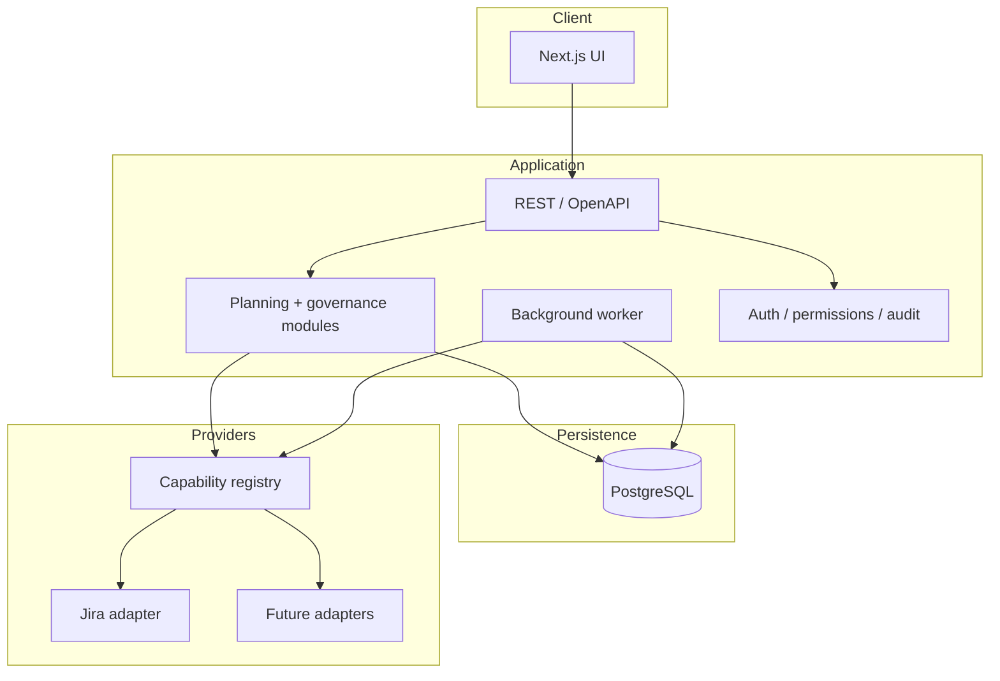

# Architecture

## System boundary

## Important boundaries

### Execution vs planning

External providers may own work items, assignees and execution facts. Planner-owned state covers capacity, resource demand, scenarios, approved baselines, governance facts and derived forecasts.

### Forecast vs baseline

A forecast is derived and may change. A baseline is explicitly approved. Treating them as the same object makes historical comparison and change control unreliable.

### Provenance

Derived results retain enough context to explain how they were produced: inputs, policy/algorithm, as-of basis and warnings.

### Failure behaviour

Unsupported provider capability remains visible as unavailable/partial. Missing information is never silently substituted with a favourable default.

## Quality gates

The private repository runs type/lint checks, integration tests, E2E tests, migration checks, documentation checks, secret scanning and release-readiness checks.
