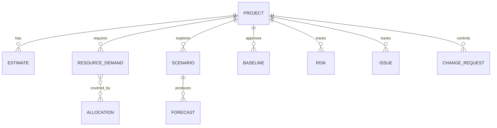

# Domain model

This is a simplified public view of the domain.

## Semantic rules

- Estimate != commitment.
- Scenario != approved baseline.
- Forecast != baseline.
- Demand != allocation.
- Role compatibility != confirmed staffing.
- Unknown != zero / false / green.

These distinctions are deliberately encoded in the model because they protect management decisions from accidental simplification.
